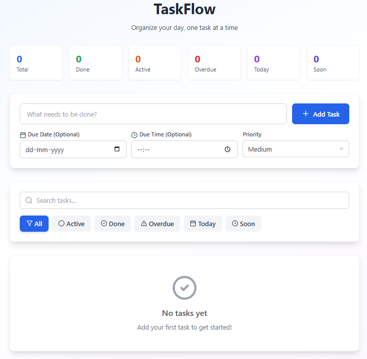

# 📝 TaskFlow – To-Do List App

A powerful and responsive To-Do List application built with **React + TypeScript + Tailwind CSS**. Created using **Bolt AI** and customized to add smart productivity features.

---

## 🚀 Features

- ✅ *Add Tasks* with title, due date, time, and priority
- ✏️ *Edit Tasks* with full control
- ✅ *Mark Complete / Incomplete*
- 🗑️ *Delete Tasks* with confirmation
- 🔍 *Search Tasks*
- 🧠 *Smart Filters*: All, Completed, Active, Today, Overdue, Upcoming
- 🎯 *Priority Labels*: Low, Medium, High
- 💾 *Data Persistence* via localStorage
- 📱 *Mobile Responsive* layout
- 🎨 Powered by Lucide React icons

---

## 📸 Preview



---

## 🔧 Tech Stack

- ⚛ React
- 🧠 TypeScript
- 💨 Tailwind CSS
- 🎨 Lucide-react icons
- ⚡ Vite

---

## 📂 How to Run Locally

```bash
git clone  https://github.com/Arcex-ai/TaskFlow
cd TaskFlow
npm install
npm run dev

